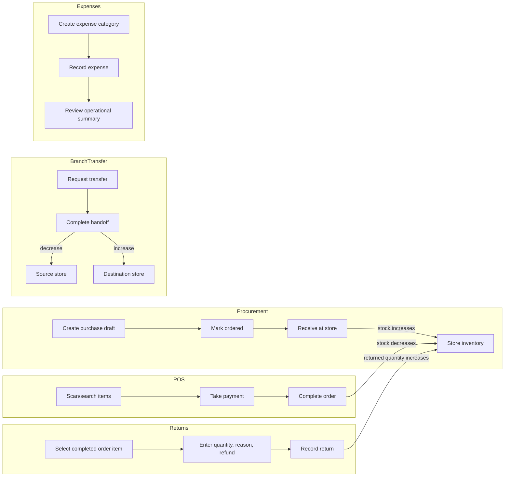

# KANITT POS Desktop

KANITT POS is the desktop client for `kanitt_server`. Tauri packages the existing React UI for Windows, macOS and Linux; the API and database remain hosted by `kanitt_server`.

## Local development

Prerequisites: Bun, Rust (stable), and the platform dependencies listed in the [Tauri v2 prerequisites](https://v2.tauri.app/start/prerequisites/).

1. Start the backend from `kanitt_server` (`bun install`, configure its `.env`, then `bun run dev`). It listens on port `6060` and serves the API under `/api`.
2. In `kanitt_win`, copy `.env.example` to `.env` and set `VITE_API_URL=http://localhost:6060`.
3. Run `bun install`, then `bun run desktop:dev`.

To use the hosted backend, set `VITE_API_URL` to its origin, for example `https://pos.oasislab.de5.net`. The client appends `/api` unless the URL already ends with `/api`. Vite reads this value when it starts, so restart the dev process after changing it.

## Build installers

Set `VITE_API_URL` to the intended deployed API origin, then run `bun run desktop:build`. Tauri writes platform bundles under `src-tauri/target/release/bundle`. Build each target on its supported host and follow the platform's signing/notarization requirements before distribution.

## Backend behavior

- Sign in with a tenant user account. Products, stores and sessions are fetched from the authenticated tenant API.
- The Manage workspace supports creating products, brands, categories, suppliers, customers and staff; recording stock adjustments; assigning product QR/barcode values; and printing QR labels. These actions use the existing tenant endpoints and their server-side role and permission checks.
- ERP Operations supports purchase orders and receiving, expense recording and expense categories, supplier payments, branch stock transfers, sales returns, and an operational summary. Receiving, transfer completion, and returns update inventory through the backend transactions.
- The Commerce Center provides desktop workflows for promotions, tax rates, cash registers, gift card issuance and reload, and customer wallet deposits/withdrawals. Access and allowed operations remain enforced by tenant server roles.
- Checkout requires a reachable server, selected store, and an open register session. Each sale is posted to `/api/tenant/orders` with the active session, then marked complete through `/complete`.
- There is no local demo catalog or offline sale queue. A network or API error keeps the cart available and displays the server error for retry.
- Promotion and tax setup screens are available, but checkout pricing still needs server-side promotion and tax calculation integration before those configurations can affect receipts. The current POS tax calculation remains a 5% client default.

## ERP workflow map

The ERP page includes an interactive **How ERP workflows work** guide. The same flows are mapped here for quick reference:

## Security note

The current desktop client persists its bearer token in browser `localStorage`. Treat desktop builds as single-user trusted devices, require TLS for remote APIs, and clear the token by signing out. Before distributing to shared or regulated terminals, replace this storage with an OS credential-store integration and add an explicit session expiry/refresh policy.
